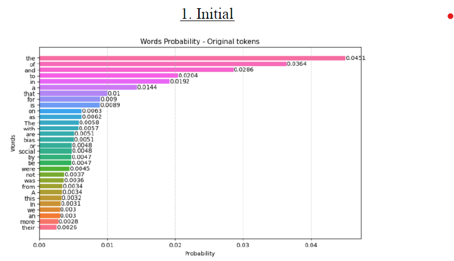
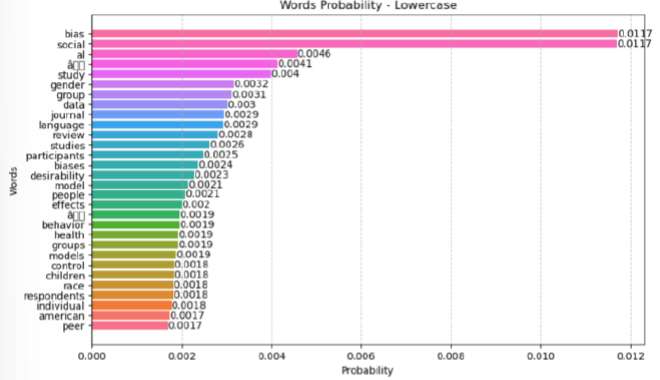
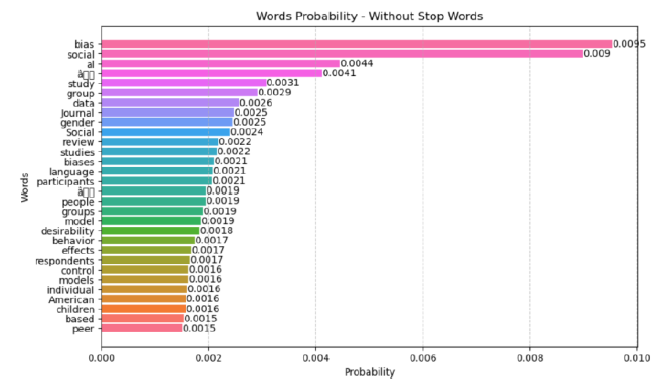
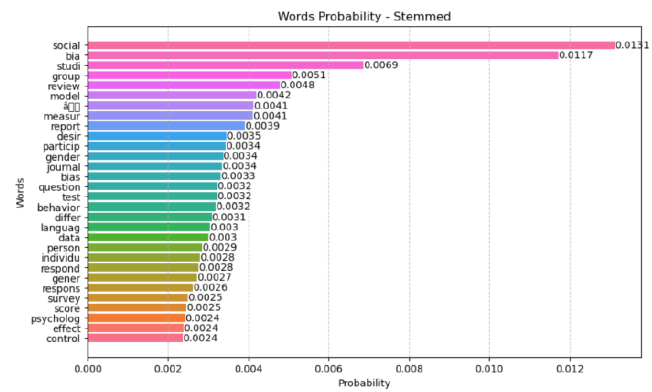

# Task 1: Language Modeling 📖  

## 📌 **Description**  
This task involves **building a probabilistic language model**, analyzing the impact of **text preprocessing** techniques such as:  
- **Tokenization**  
- **Stop Words Removal**  
- **Case Folding**  
- **Stemming**  

## 🎯 **Objective**  
To observe how linguistic operations impact the size of vocabulary and frequency of words.  

---

## 📊 **Results**  
| Preprocessing Step | Vocabulary Size | Words Distribution | Total Words  |
|-------------------|----------------|-------------|-------------|
| **Raw Data** | 37,408 || 494,900 |
| **Stop Words Removed** | 36,191 || 263,856 |
| **Case Folding** | 31,134 || 263,856 |
| **Stemming** | 24,045 || 263,856 |

---

## 📂 **Files**  
- 📜 `Language_Modeling.ipynb` – Jupyter Notebook containing the full analysis.  
- 📄 `stop_words_english.txt` – List of stop words used for filtering.  

---

## 🚀 **Usage**
Run the notebook with:  
```bash
jupyter notebook TASK_1_Language_Modeling.ipynb
