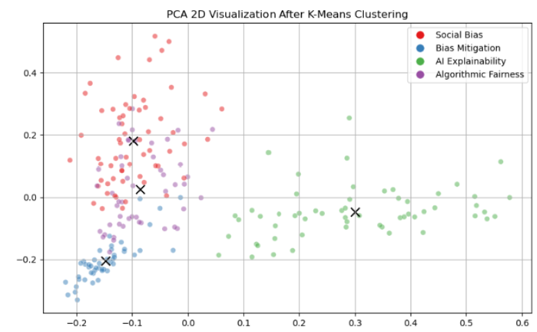
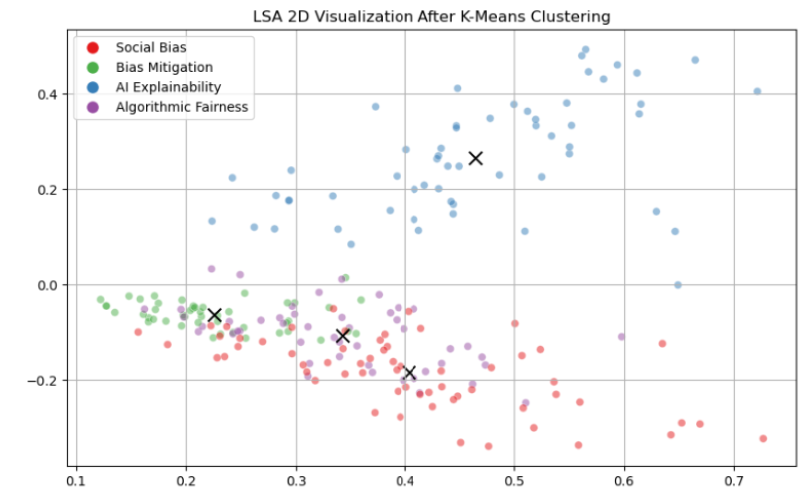

# Task 3: Text Clustering 🔍  

## 📌 **Description**  
This task involves **unsupervised clustering** of texts using **K-Means** and dimensionality reduction techniques **PCA & LSA**.  
The objective is to group similar texts together and evaluate the quality of the clusters using various clustering evaluation metrics.

---

## 🎯 **Objective**  
- Perform **K-Means clustering** on a collection of texts.  
- Use **TF-IDF vectorization** to represent text documents numerically.  
- Reduce dimensionality with **PCA and LSA** for better visualization.  
- Evaluate clustering quality using multiple metrics.

---

## 📊 **Results**  

| Metric | Score |
|--------|--------|
| **Accuracy** | 80.28% |
| **Adjusted Rand Index (ARI)** | 0.5919 |
| **Adjusted Mutual Information (AMI)** | 0.6035 |
| **Homogeneity** | 0.6087 |
| **Completeness** | 0.6108 |
| **V-measure** | 0.6097 |

📌 **Key Takeaways:**  
- **K-Means achieved 80% clustering accuracy**, showing a strong separation between text categories.  
- **PCA and LSA were used for visualization**, and PCA showed slightly better cluster separation.  
- Some overlap between clusters indicates that topics within texts are not entirely distinct.  

---

## 📸 **Visualization of Clusters**  
| PCA-Based Clustering | LSA-Based Clustering |
|----------------------|----------------------|
|  |  |

---

## 📂 **Files**  
- 📜 `Text_Clustering.ipynb` – Jupyter Notebook containing the full clustering analysis.  

---

## 🚀 **Usage**  
Run the notebook with:  
```bash
jupyter notebook Text_Clustering.ipynb
